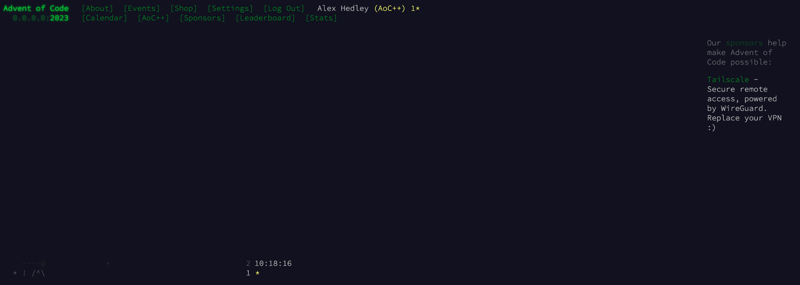

# Docs

```bash
                               .   '    '  .     
                                                 
                         '                     ' 
                                           *       
                 ...''''                         
              .''                  *               
            .'                    /              
            :             /\    -/  :
            '.            -   - /  .'
              ' .    -     -   *..'                 
----@            '''..*......'''                   
  * ! /^\                                          
```

```bash
                                           *       
                                   *               
                               *                   
                      *                            
  *                                                
```

- [Stats](STATS.md)


